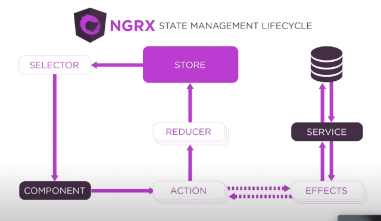

# Aplicações avançadas com Angular 

## Change Detection 
- Mecanismo que nota mudanças no estado da aplicação ou componente
- Processo executados nas view começando pelo AppComponent
- Unidirecional (de cima para baixo na árvore de componentes, o filho nao manda CD par ao pai )
- O Angular entende seus componentes como Views 
-  O que causa mudanças ?
- Eventos do DOM (click focus submit ... )
- HTTP Requests
- Times setTimeout setInterval 
- Obs: todos são eventos assíncronos

## Zones 
- Executar um pedaço de código dentro de um wrapper
- wrapper sabe quando o código começou e terminou de ser executado 
- NgZone (é uma aplicação angular do zonejs)
- método tick itera pelo nosso array de changedetectionrefs  e 

chama o detect changes


- Ciclo de vida : 

- Inicialização -> OnInit -> View Pronta -> ngAfterViewInit -> ngOnDestroy (lifecicle hooks)
- Existem mais ciclos 
- ngOnchanges ngDoCheck ngAgterContentInit ngAfterContentChecked 


- pai e filho trocando informações 

- mudança

- o componente checka o binding e verifica se o novo valor mudou 
- mudanca detalhada :


- o codigo acima gera um erro 
- estamos rodando em developer mode 
- em developer mode temos um passo a mais no cd 
- temos um double check no old  novo binding
- se a expressão for modificada depois de calculada ele dispara um erro 
- value retorna um valor novo mas nao estamos disparando nenhuma ação assíncrona para disparar o value 
- implementar o lifecicle hook doCheck 

``` JS 
value = this._value;
ngDoCheck (){
    this.value = this._value; 
}
private get _value(): number{
    return MAth.floor(Math.random()*10);
}
```
- Solução usando zones 

``` JS 
value = this._value;
constructor (private ngZone:NgZone){
    ngZone.runOutsideAngular(()=>
    setInterval(
        ()=> this.value = this._value,1);
    );
} /// atualiza a view 1 ms rodando o bloco fora da zones do angular 
private get _value(): number{
    return MAth.floor(Math.random()*10);
}
```

Quando o change detection é executado em um componente, qual dessas ações acontece?
Executa ngAfterViewChecked no componente filho.


O que significa o erro ExpressionChangedAfterItHasBeenChecked?
Que o valor foi atualizado entre a primeira verificação e a segunda, que só acontece em modo de desenvolvimento.


Se um dos valores presentes na estrutura de dados chamada bindings tiver sido atualizado.

Qual das seguintes frases a seguir, relacionadas a Zones, está incorreta?
Não podemos executar códigos fora do NgZone.

Qual método do cíclo de vida é executado em toda execução do change detection?
ngDoCheck.

Que tipo de ações disparam uma rodada de change detection na aplicação?

Assíncronas.

O que acontece se um valor for atualizado depois de ter sido verificado?
Teremos inconsistência de informação pois o novo valor não foi renderizado na nossa View.

Quem guarda a lista de ChangeDetectorRef?
ApplicationRef.


Ao executar change detection em um componente pai:
A View de componente filho fica pronta apenas depois de o change detection ser executado nele mesmo.


Em que situação o Angular atualiza uma View durante a execução do change detection?
Se um dos valores presentes na estrutura de dados chamada bindings tiver sido atualizado.

Um pedaço de código assíncrono executado fora de uma Zone:
Não dispara change detection.

## Trabalho com estrutura e Otimização 

- Criou um <router-outlet> no html do app 
- Tudo que se repete na app inteira coloque no app component navbar , menu , footer ... 
- é interessante também não fazer isso pois a aplicação fica mais livre para mudar sem usar ngif para escoder as informações 
- cookies , bootstrap ... tudo no app component

##  app-component.ts


-  feature A está sendo importada no appmodule pois aparece assim que a aplicação é carregada 
##  app-module.ts


- a feature b está sendo lazy loaded (loadChieldren com bundle externo) e será acessada por /featureb
##  app-routing.ts
- pages / features informações renderizadas no router-outlet


- 
##  featureamodule.ts
- feature a guardará todas as rotas (poderia ser um feature-module mas ele preferiu assim )
- RootFeatureAComponent raiz da feature A 


##  featurebmodule.ts
- lazy loaded
- na raiz faz-se loadchildren


## Estrutura de organizaçao 


- content c será uma feature completamente separada 
- abriu a pagina onde quero criar o modulo com o botao direito e abrindo o terminal 
- ng g m features/content-c

- queremos ter modulos separadas , onda cada um tem sua propria responsabilidade 
- content c será um modulo completamente a parte 
- c é carregado dinamicamente pela rota 

- rota do content c module 

- tudo que depende de c está na feature c (isolado das features a e b)


- shared - compartilhada para aplicação 
- declara e exporta os componentes shared 


# Parte 2  

- varios eventos que disparam o change detection 
- colocou um setInterval no navbar para ativar o change detection 
- cuidado com o que vc coloca dentro do método get. O change detection vai ficar rerenderizando o componente se houver alguma lógica muito grande e isto não é performático. 
- podemos bloquear a execução no change detector par um componente 
-  Desligando o change detector no construtor 

- ng oninit está sendo executado mas a view nao está sendo atualizada
- e se queremos que ele apareça ? 
- usamos outro lifecicle AfterView Init 
- Removemos o componente da arvore de detecção de mudanças 

- E se quisermos que o cd rode novamente ? 
- this.cdRef.reattach;  (mas não garante que ocorra apenas uma detecção )
- Outra forma : detectChanges () marca a view e os filhos para verificar mudanças 

- podemos portanto decidir quando rodar o change detection 
- em um componente maior ou mais de um evento isso é uma abordagem que não escala . 

# Parte 3 
- forma melhor para conseguir escalar com performance usando o change detection 
- padrão container x presenter
- componentes reutilizáveis 

## Presenter
- (Dumb components)
- Se preocupam como as coisas são mostradas 
- Recebem informação via input
- nao guardam estado 
- recebem informação 
- Emitem eventos para o componente pai via Output
- Podem ter presenters e container dentro deles 
- podem ser mais performáticos com OnPush (change detection strategy )
## Container 
- Se preocupa como as coisas funcionam
- Consomem e geram informação de serviços 
- disparam ações com base nos eventos do componente filho 
- tem noção de estado 
- podem ter presenters e containers dentro deles 
- Store centralizada 

- content c será presenter
- root content c será o container 
- separamos em duas pastas dentro da feature , uma pasta presenter e outra content 
- RootcontentC

- contentcchild

- ja podemos usar a informação dentro do child 

- se usarmso o change detection
-construimos um método dentro do c-child como o userfullname é um binding ele fica rodando sem parar 

- podemos fazer que o cd nao rode para este componente 
- nao queremos parar e voltar a fazer o cd 
- mudamos a estratégia do componente ChangeDetectionStrategy é por default Default
- vamos usar o OnPush
- este componente só roda o Cd quando alguma propriedade que entra no componente via input seja modificada 
- so quando user for mudado ele será rerenderizado (era a resposta do desafio :( ))
- 
- reusabilidade 
- poderia ter text1 e outro input text 2 no c child
- ele poderia simplesmente concatenar os dois  e o componente faria sempre isso , concatenar informações 
- veja como o rootcontent é reutilizavel ! 
- 
- vamos mudar a forma como recebemos o observable user 
- 
- removemos o complete pois vamos mante-lo vivo 
- mudamos o user para que se torne um observable de maneira que podemos usar sua referencia depois 
- 
- agora this.users retorna um observable 
- 
- não preciso mudar o meu input no root content. basta alterar sua uitilização 
- 
- podemos usar o async para que o observable seja destruido quando a view for destruida 
- 
- Posso agora passar novas propriedades para este objeto através de um pipe 
 
- e claro posso usar esta informação no meu child 
 
 - o caontainer recebe e lida com o estado 
 - o presenter nao sabe como funciona só apresenta
 - vamos fazer o contador nesta estrutura 
 - criamos um counter inicializado com valor 0 dentro do root content -c 
 - o presenter vai receber o conter via input e vai ter como output o increment e outro decrement 
 - teremos dois botoes no child um para incrementar e outro decrementar 
 - this.counter++ 
 - e this.counter-- 
 - fazemos o bind no child component 
 
 
 - o presenter está apensa emitindo o valor nao está de fato implementando 
 - pai injeta no filho e mostra na tela. Acontece um enveto , o filho dispara pro pai fazer o handle que vai atualizar a informação injetada 
 - cuidado que componentes do tipo presenter nao dever modificiar o estado fazendo por exemplo this.counter++ no filho (as responsabilidades não estão separadas)
 - 
 O que não é comum de um componente do tipo presenter fazer?
 Se comunicar diretamente com serviços.

Considerando a estrutura abordada no vídeo, o que são páginas?
Feature modules que são renderizados no router-outlet raiz da aplicação.

Qual o ponto negativo de alterar manualmente o comportamento do change detection dentro de um componente?
Quanto maior o componente e sua árvore de componentes filhos, mais difícil é lidar com os eventos que marcam o componente para ser verificado e que removem ele da execução.


O que não é comum de um componente do tipo container fazer?
Lidar com uma grande quantidade de eventos vindos de componentes filho distintos.

Qual a vantagem de utilizar OnPush como estratégia de change detection?
Faz o change detection rodar apenas quando a referência de um Input é atualizada, ótimo para componentes do tipo presenter.

Qual a consequência de remover um componente da árvore de change detection?
A view não é atualizada.

Um mau gerenciamento da comunicação entre componente do tipo container e componente do tipo presenter pode acarretar em:
Inconsistência de informação.

Qual das situações a seguir pode ser considerada não performática?
Componente com ChangeDetectionStrategy.Default e com binds com o template com cálculos pesados.

Qual das afirmações a seguir não é um ponto positivo sobre utilizar o async pipe para injetar informação em um componente filho?
Nenhuma das alternativas.

Qual não é um ponto positivo sobre a estrutura proposta no vídeo?
Torna a necessidade de shared components inútil.

## Gerenciamento de estado

- Escalabilidade 
- uma aplicação de TODO interessante 
- vamos fazer mvc depois melhorar depois usar redux 
- git clone https://github.com/JGhignatti/jv-state.git 
- vou tentar seguir ele dessa vez 
- Dentro do PAI : Vamos comunicar duas features irmas , filhas de dashboard , last-todo e create-todo. Quando o componente for criado em created-todo  o pai vai perceber atavés de um ViewChild e vai  
avisar o last-todo

  <!-- create todo e last são irmaos vamos fazer um -->
  <!-- arco para que se comuniquem  -->
  <div class="content-1">
    <jv-last-todos></jv-last-todos>
  </div>

  <!-- criei o on created para lidar com o output -->
  <div class="content-2">
    <jv-create-todo (created)="onCreated($event)"></jv-create-todo>
  </div>
  
  - Quando algo é criado no create todo ele emite um evento 

   @Output() created = new EventEmitter /// emite o evento da criaçaõ 
  titleControl = new FormControl('');

  save() {
    this.todoService.create( { title: this.titleControl.value})
     .subscribe( todo => this. created.emit(todo) ) 
     /// created todo é irmao do last-todos 
     /// qual a melhor forma desses componentes se comunicates 
  }


  - Dentro do PAI : O pai está olhando a emissão do evento no create-todo através de um ViewChild que recebe a informação e avisa o last-todo através de uma instancia do LastTodosComponent

  /// recebe e passa a informação para outro child 
  @ViewChild(LastTodosComponent, {static:false}) lastTodos : LastTodosComponent ;


- Dentro do PAI : Enviamos a informação do componente dashboard que tem um método OnCreated 

  onCreated(todo: Todo){
    this.lastTodos.handleCreated(todo); /// vou agora no last todo precimaos criar esse metodo que recebe esta informação 
  }

- Dentro do last-todo : REcebemos e manipulamos  a alteração 

  handleCreated (todo:Todo){
    this.list = [todo, ...this.list];
  }
  
  - Resumo : O filho sofre alteração , emite um evento via output, o pai percebe a emissão deste evento e avisa o outro filho 
  
  - Funciona mas é facil perder algum comportamento no meio desta comunicação , exemplo mudar o dashboard, algum movimento do componente . 

  - Vamos usar outros padrões para melhorar isso 
- vamos fazer o login 
- login components tem a referencia do usuario que não está sendo compartilhando ocm mais nenuhm outro componente 
- vamos usar um servico para compartilhar informação. Estamos acostumados em usar serviços para requests HTTP , mas esse não é o principal motivo pelo qual existem. 
- serviços existem para compartilhar a mesma instância de uma classe para mais de um componente ou para outro serviço pai 

- - dois componentes que consomem o mesmo serviço conseguem ver a informação 

- criamos um serviço (user context que injeta no root (aplicação)  a informação do usuario. Ele mantem a informação
viva apos a morte do componente login de maneira que o usuario 
possa ser acessado em toda a aplicação 
```JS 
import { Injectable } from "@angular/core";
import { User } from '../models/user.model';


/// esse servico vai prover o user para todos que tem acesso ao root
/// criamos um servico provido na aplicacao inteira 
//// a informacao eh o usuario logado atualmente 
/// recebe (todos ) e set (logincomponent)
@Injectable({ providedIn: 'root' })
export class UserContextService {

  private _user: User;

  get user(): User {
    return this._user;
  }

  set user(value: User) {
    this._user = value;
  }
}
```


- para acessar essa infromação em outro componente, precisamos 
instanciar o servico no componente e usar o metodo set e get
do servico 

- criamos o servico na mao (nao usamos o angular-cli) e importamos o provide
dentro do modulo dashboard


<div class="greetings">
    <h1>Olá, {{ userContext.user.name }}</h1>
  </div>


- vamos fazer o mesmo para a lista , vamos compartilhar a lista entre o last-todo 
e o list-component 

- vamos criar um servico dentro do dashboard 
- esse servico sera acessado pelo list-component que recebera as informações da lista
- precisamos calcular uma nova pagina 
- vamos mover o page para dentro do list service pois ele vai ser uma 
informação compartilhada 

- create todo deve atualizar a lista do servico 
- precisamos usar observables para poder trabalhar desta forma atualizando o listservice ao inves de variaveis locais 
- sempre que a lista for setada todos que estao ouvindo vao ser atualizados 
- vamos tirar a responsabilidade de fazer o list de cada componente e vamos 
colocar tudo para o listservice 
- assim teremos certeza que o listservice será atualizado 
## Redux 
- Usaremos o redux para centralizar as informações 
- ngrx implmentação do redux para angular 


- store : json grande que guarda o estado da aplicação 
- usuario logado , estado de loading ... 
- serve como fonte da verdade 
- informações centralizadas 
- componentes apenas consomem a  informação 
- reducer -> recebe infromações e reduz a uma informacão só 
- recebe o estado atual e a action , juntando a action e o estado atual gera um novo estado 
- dado o mesmo input deve gerar o mesmo  output 
- a store passará a ser a fonte da verdade (antes era o service )

- vamos começar de novo agora usando ngrx 

ng add @ngrx/store@latest
ng add @ngrx/store-devtools@latest
ng add @ngrx/effects@latest
ng add @ngrx/router-store@latest

## Desenvolvendo createReducer e effects

- estamos escrevendo o app.actions e o app.reducer 

- para fazer chamadas e roteamento usamos effects 
- (side effects de uma action )
-criamos um app.effects.ts 
- componente dispara uma action que cai tanto no reducer quanto no effects 
- o reducer modifica o estado 
- e o effect nao retorna por enquanto só da um concole log 
- ok conseguimos pegar a informação através de um servico que chamado por um effect que dispara uma action que dipara um reducer que altera a store. agora precisamos passar isso para o componente usando selector 
- criamos o app.selectors.ts

Em que ponto o Redux do NgRx se parece com a última implementação do ListService?

A responsabilidade dos componentes é disparar ações e ouvir as mudanças geradas por essas ações.

Ao atualizar o ListService para conter os métodos que servem como interface entre as chamadas HTTP e os componentes, qual se torna a responsabilidade dos componentes?
Disparar um comando para o ListService e ouvir as mudanças que esse comando gerou.

Qual das seguintes afirmações é verdade sobre a comunicação entre o create-todo component e o last-todos component na primeira solução para gerenciamento de estado mostrada no vídeo (MVC, componentes não compartilham informação, etc)?
Não é a melhor implementação possível fazer o todo criado ser mandado para o dashboard component, para então ser passado para atualizar a lista no last-todos.

Assinale a alternativa que completa de forma errada a frase "Um Effect pode ___".
Ser executado sem ser como resposta a uma action disparada.

Para que serve um serviço no Angular?
Compartilhar informação, dentre outras coisas, entre componentes, diretivas, serviços, etc.

Qual das seguintes afirmações não é um ponto positivo sobre a utilização de seletores?
Seletores nos possibilitam interceptar novas actions disparadas para selecionar um novo pedaço da Store.

Qual das afirmações é verdadeira sobre compartilhar estado criando uma interface utilizando Observables?
Possibilita os componentes a ouvir à modificações e reagir a elas.

Qual das seguintes afirmações é verdade sobre a primeira solução para gerenciamento de estado mostrada no vídeo (MVC, componentes não compartilham informação, etc)?
Como a informação não é persistida acontecem muitos loads ao navegar entre páginas.

Qual o problema encontrado ao criar um novo todo na segunda solução mostrada no vídeo (a que utiliza o ListService)?
O last-todos component não reage às mudanças do estado da lista que está dentro do ListService.

Para que serve o Reducer do NgRx?
Para calcular o novo estado com base no estado atual e a Action disparada.


# Introdução à  Testes automatizados 

- unitário : porções individuais de código sem dependência 
- integração :  componentes , diretivas , serviços com dduas dependencaias , chamadas http , view 
- teste end to end : e2e fluxo da aplicação e se as ações esperadas e nao esperadas geram estados esperados 


## Jasmine e Karma 

- Jasmine  - framework onde o teste é descrito 
- Karma : Task Runner define o frameword de testes , browser , etc 
- vou usar o jv-state-ngrx para esta parte de testes (que usa as ultimas implementações que ele fez )

- karmaconfig nao mudamos 
- tests.ts 
- ngtest no componente 

## Implementando e otimizando testes 

- o karma reclama que não há provider para a store 
- no teste module nao está requisitando a store 
- ngrx tem funcoes de auxilio 
- provideMockStore(), prove uma store mock 
- nao há definicao de estado 
- o comoponente usa um selector 
- o providemock permite fazer um override do comportamento dos seletores 
- da muito trabalho se forem mutios seletores  
- podemos passar o initialState 

 provideMockStore({ initialState: { list: listInitialState } }),

- precisamos pegar uma referencia para a store 
 let store: MockStore<any>;

 - injeções que nao sao default do angular pegamos de um jeito diferente 

 store = TestBed.inject(MockStore);

 agora a store está pronta 

 - vamos fazer a validação de quando o carregando está sendo carregado 

```
 it('should show loading indicator', () => {
    store.setState({
      list: {
        ...listInitialState,
        loading: true,
      },
    });
    fixture.detectChanges();

    const loading = fixture.debugElement.query(By.css('span'));

    expect(loading).toBeTruthy();
  });

  ```

  - interessante rxjs jasmine-marbles
- vamos testar serviços que fazem chamadas http 
- jv-state-ngrx\src\app\shared\services\json-placeholder.service.ts

- cypress - o melhor para testes e2e 
- jest - funciona com virtual dom 

Por que precisamos do HttpTestingController ao escrever testes para um serviço que faz chamadas HTTP?

Pois ele nos dá uma interface para aferir a qualidade e os valores esperados tanto passados quanto recebidos pela request.

Por que precisamos de um TestingModule?
Para facilidade, para não precisar declarar todos os componentes, serviços, etc e suas dependências.

Por que, ao testar os Effects, o TodosService não foi provido de forma convencional?
Pois como o objetivo dos testes era validar o comportamento dos Effects, não devemos nos importar como os métodos dentro do serviço foram implementados, logo, podemos fazer a definição mais simples dele.

O que um teste unitário pode testar?
Uma função pura.

Para que serve um teste e2e?
Para validar o fluxo de uma feature de ponta a ponta.

Para testar Effects nós:
Criamos Observables mock para a ação disparada e a ação esperada no retorno, então validamos se o resultado do Effect é o Observable que esperávamos receber.

Qual o propósito de ter um beforeEach ou afterEach na definição de um teste?
Para executar alguma pedaço de código que seja comum entre todos os testes, antes e/
ou depois de cada um deles ser executado.

O que um teste de integração não pode testar?
Se o fluxo de uma feature inteira funciona como esperado.

Quando precisamos rodar o change detection de um componente que estamos testando?
Quando atualizamos alguma informação que é um bind com a View e queremos verificar se ela foi atualizada.

Qual o padrão mostrado ao escrever testes?
AAA - Arrange, Act, Assert.


## Control Value Accessor 

- uma api nao mutio conhecida do angular 
- age como ponte entre a api de forms do angular e um elemento nativo do DOM 
- Interage com um formControl, criado explicitamente ou não 
- typeahead 
- jv-control-value-accessor
- vamos transformar o typeahead component em um input usando o control value accessor 
- conseguimos colocalo dentro de uma diretiva 
- uma coleção de componentes de ui 

Para que serve o método setDisabledState?
Nenhuma das alternativas.

Assinale a alternativa incorreta.
FormControl só existe quando trabalhamos com Reactive Forms.

Para que serve o método registerOnChange?
Para passar para o componente uma função que pode ser executada para atualizar o FormControl que está sendo injetado nele.

Por que precisamos modificar o comportamento do injetor de dependências para o componente que implementa ControlValueAccessor?
Para prevenir o Angular de tentar procurar a dependência fora do injetor do componente que implementa o ControlValueAccessor.

Para que serve o método wirteValue?
Para o componente pai notificar o componente ControlValueAccessor que o FormControl foi atualizado por fora.

Para que serve o método registerOnTouched?
Para passar para o componente uma função que pode ser executada para marcar o FormControl que está sendo injetado nele como touched.

Por que utilizar ControlValueAccessor?
Abstrair um comportamento dentro de um componente e que esse componente se comunique diretamente com o FormControl/FormGroup definido no componente pai.


