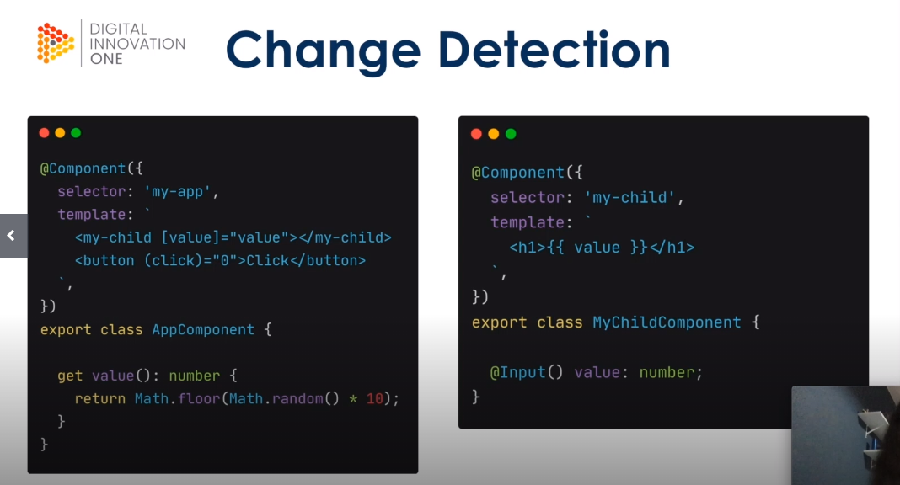
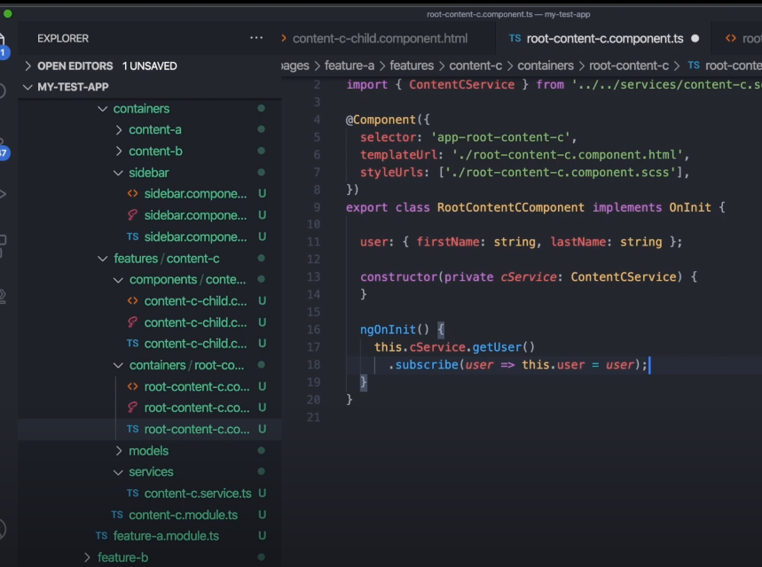
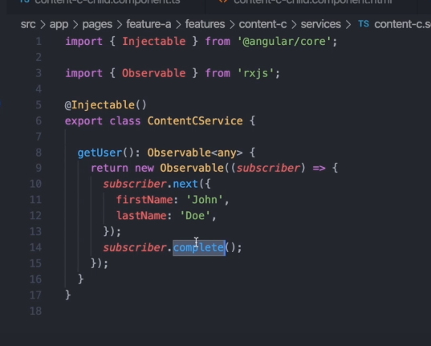

# Aplicações avançadas com Angular 

## Change Detection 
- Mecanismo que nota mudanças no estado da aplicação ou componente
- Processo executados nas view começando pelo AppComponent
- Unidirecional (de cima para baixo na árvore de componentes, o filho nao manda CD par ao pai )
- O Angular entende seus componentes como Views 
-  O que causa mudanças ?
- Eventos do DOM (click focus submit ... )
- HTTP Requests
- Times setTimeout setInterval 
- Obs: todos são eventos assíncronos

## Zones 
- Executar um pedaço de código dentro de um wrapper
- wrapper sabe quando o código começou e terminou de ser executado 
- NgZone (é uma aplicação angular do zonejs)
- método tick itera pelo nosso array de changedetectionrefs  e 

chama o detect changes


- Ciclo de vida : 

- Inicialização -> OnInit -> View Pronta -> ngAfterViewInit -> ngOnDestroy (lifecicle hooks)
- Existem mais ciclos 
- ngOnchanges ngDoCheck ngAgterContentInit ngAfterContentChecked 


- pai e filho trocando informações 

- mudança

- o componente checka o binding e verifica se o novo valor mudou 
- mudanca detalhada :


- o codigo acima gera um erro 
- estamos rodando em developer mode 
- em developer mode temos um passo a mais no cd 
- temos um double check no old  novo binding
- se a expressão for modificada depois de calculada ele dispara um erro 
- value retorna um valor novo mas nao estamos disparando nenhuma ação assíncrona para disparar o value 
- implementar o lifecicle hook doCheck 

``` JS 
value = this._value;
ngDoCheck (){
    this.value = this._value; 
}
private get _value(): number{
    return MAth.floor(Math.random()*10);
}
```
- Solução usando zones 

``` JS 
value = this._value;
constructor (private ngZone:NgZone){
    ngZone.runOutsideAngular(()=>
    setInterval(
        ()=> this.value = this._value,1);
    );
} /// atualiza a view 1 ms rodando o bloco fora da zones do angular 
private get _value(): number{
    return MAth.floor(Math.random()*10);
}
```

Quando o change detection é executado em um componente, qual dessas ações acontece?
Executa ngAfterViewChecked no componente filho.


O que significa o erro ExpressionChangedAfterItHasBeenChecked?
Que o valor foi atualizado entre a primeira verificação e a segunda, que só acontece em modo de desenvolvimento.


Se um dos valores presentes na estrutura de dados chamada bindings tiver sido atualizado.

Qual das seguintes frases a seguir, relacionadas a Zones, está incorreta?
Não podemos executar códigos fora do NgZone.

Qual método do cíclo de vida é executado em toda execução do change detection?
ngDoCheck.

Que tipo de ações disparam uma rodada de change detection na aplicação?

Assíncronas.

O que acontece se um valor for atualizado depois de ter sido verificado?
Teremos inconsistência de informação pois o novo valor não foi renderizado na nossa View.

Quem guarda a lista de ChangeDetectorRef?
ApplicationRef.


Ao executar change detection em um componente pai:
A View de componente filho fica pronta apenas depois de o change detection ser executado nele mesmo.


Em que situação o Angular atualiza uma View durante a execução do change detection?
Se um dos valores presentes na estrutura de dados chamada bindings tiver sido atualizado.

Um pedaço de código assíncrono executado fora de uma Zone:
Não dispara change detection.

## Trabalho com estrutura e Otimização 

- Criou um <router-outlet> no html do app 
- Tudo que se repete na app inteira coloque no app component navbar , menu , footer ... 
- é interessante também não fazer isso pois a aplicação fica mais livre para mudar sem usar ngif para escoder as informações 
- cookies , bootstrap ... tudo no app component

##  app-component.ts


-  feature A está sendo importada no appmodule pois aparece assim que a aplicação é carregada 
##  app-module.ts


- a feature b está sendo lazy loaded (loadChieldren com bundle externo) e será acessada por /featureb
##  app-routing.ts
- pages / features informações renderizadas no router-outlet


- 
##  featureamodule.ts
- feature a guardará todas as rotas (poderia ser um feature-module mas ele preferiu assim )
- RootFeatureAComponent raiz da feature A 


##  featurebmodule.ts
- lazy loaded
- na raiz faz-se loadchildren


## Estrutura de organizaçao 


- content c será uma feature completamente separada 
- abriu a pagina onde quero criar o modulo com o botao direito e abrindo o terminal 
- ng g m features/content-c

- queremos ter modulos separadas , onda cada um tem sua propria responsabilidade 
- content c será um modulo completamente a parte 
- c é carregado dinamicamente pela rota 

- rota do content c module 

- tudo que depende de c está na feature c (isolado das features a e b)


- shared - compartilhada para aplicação 
- declara e exporta os componentes shared 


# Parte 2  

- varios eventos que disparam o change detection 
- colocou um setInterval no navbar para ativar o change detection 
- cuidado com o que vc coloca dentro do método get. O change detection vai ficar rerenderizando o componente se houver alguma lógica muito grande e isto não é performático. 
- podemos bloquear a execução no change detector par um componente 
-  Desligando o change detector no construtor 

- ng oninit está sendo executado mas a view nao está sendo atualizada
- e se queremos que ele apareça ? 
- usamos outro lifecicle AfterView Init 
- Removemos o componente da arvore de detecção de mudanças 

- E se quisermos que o cd rode novamente ? 
- this.cdRef.reattach;  (mas não garante que ocorra apenas uma detecção )
- Outra forma : detectChanges () marca a view e os filhos para verificar mudanças 

- podemos portanto decidir quando rodar o change detection 
- em um componente maior ou mais de um evento isso é uma abordagem que não escala . 

# Parte 3 
- forma melhor para conseguir escalar com performance usando o change detection 
- padrão container x presenter
- componentes reutilizáveis 

## Presenter
- (Dumb components)
- Se preocupam como as coisas são mostradas 
- Recebem informação via input
- nao guardam estado 
- recebem informação 
- Emitem eventos para o componente pai via Output
- Podem ter presenters e container dentro deles 
- podem ser mais performáticos com OnPush (change detection strategy )
## Container 
- Se preocupa como as coisas funcionam
- Consomem e geram informação de serviços 
- disparam ações com base nos eventos do componente filho 
- tem noção de estado 
- podem ter presenters e containers dentro deles 
- Store centralizada 

- content c será presenter
- root content c será o container 
- separamos em duas pastas dentro da feature , uma pasta presenter e outra content 
- RootcontentC

- contentcchild

- ja podemos usar a informação dentro do child 

- se usarmso o change detection
-construimos um método dentro do c-child como o userfullname é um binding ele fica rodando sem parar 

- podemos fazer que o cd nao rode para este componente 
- nao queremos parar e voltar a fazer o cd 
- mudamos a estratégia do componente ChangeDetectionStrategy é por default Default
- vamos usar o OnPush
- este componente só roda o Cd quando alguma propriedade que entra no componente via input seja modificada 
- so quando user for mudado ele será rerenderizado (era a resposta do desafio :( ))
- 
- reusabilidade 
- poderia ter text1 e outro input text 2 no c child
- ele poderia simplesmente concatenar os dois  e o componente faria sempre isso , concatenar informações 
- veja como o rootcontent é reutilizavel ! 
- 
- vamos mudar a forma como recebemos o observable user 
- 
- removemos o complete pois vamos mante-lo vivo 
- mudamos o user para que se torne um observable de maneira que podemos usar sua referencia depois 
- 
- agora this.users retorna um observable 
- 
- não preciso mudar o meu input no root content. basta alterar sua uitilização 
- 
- podemos usar o async para que o observable seja destruido quando a view for destruida 
- 
- Posso agora passar novas propriedades para este objeto através de um pipe 
 
- e claro posso usar esta informação no meu child 
 
 - o caontainer recebe e lida com o estado 
 - o presenter nao sabe como funciona só apresenta
 - vamos fazer o contador nesta estrutura 
 - criamos um counter inicializado com valor 0 dentro do root content -c 
 - o presenter vai receber o conter via input e vai ter como output o increment e outro decrement 
 - teremos dois botoes no child um para incrementar e outro decrementar 
 - this.counter++ 
 - e this.counter-- 
 - fazemos o bind no child component 
 
 
 - o presenter está apensa emitindo o valor nao está de fato implementando 
 - pai injeta no filho e mostra na tela. Acontece um enveto , o filho dispara pro pai fazer o handle que vai atualizar a informação injetada 
 - cuidado que componentes do tipo presenter nao dever modificiar o estado fazendo por exemplo this.counter++ no filho (as responsabilidades não estão separadas)
 - 
 O que não é comum de um componente do tipo presenter fazer?
 Se comunicar diretamente com serviços.

Considerando a estrutura abordada no vídeo, o que são páginas?
Feature modules que são renderizados no router-outlet raiz da aplicação.

Qual o ponto negativo de alterar manualmente o comportamento do change detection dentro de um componente?
Quanto maior o componente e sua árvore de componentes filhos, mais difícil é lidar com os eventos que marcam o componente para ser verificado e que removem ele da execução.


O que não é comum de um componente do tipo container fazer?
Lidar com uma grande quantidade de eventos vindos de componentes filho distintos.

Qual a vantagem de utilizar OnPush como estratégia de change detection?
Faz o change detection rodar apenas quando a referência de um Input é atualizada, ótimo para componentes do tipo presenter.

Qual a consequência de remover um componente da árvore de change detection?
A view não é atualizada.

Um mau gerenciamento da comunicação entre componente do tipo container e componente do tipo presenter pode acarretar em:
Inconsistência de informação.

Qual das situações a seguir pode ser considerada não performática?
Componente com ChangeDetectionStrategy.Default e com binds com o template com cálculos pesados.

Qual das afirmações a seguir não é um ponto positivo sobre utilizar o async pipe para injetar informação em um componente filho?
Nenhuma das alternativas.

Qual não é um ponto positivo sobre a estrutura proposta no vídeo?
Torna a necessidade de shared components inútil.

## Gerenciamento de estado

- Escalabilidade 
- uma aplicação de TODO interessante 
- vamos fazer mvc depois melhorar depois usar redux 
- git clone https://github.com/JGhignatti/jv-state.git 
- vou tentar seguir ele dessa vez 
- Dentro do PAI : Vamos comunicar duas features irmas , filhas de dashboard , last-todo e create-todo. Quando o componente for criado em created-todo  o pai vai perceber atavés de um ViewChild e vai  
avisar o last-todo

  <!-- create todo e last são irmaos vamos fazer um -->
  <!-- arco para que se comuniquem  -->
  <div class="content-1">
    <jv-last-todos></jv-last-todos>
  </div>

  <!-- criei o on created para lidar com o output -->
  <div class="content-2">
    <jv-create-todo (created)="onCreated($event)"></jv-create-todo>
  </div>
  
  - Quando algo é criado no create todo ele emite um evento 

   @Output() created = new EventEmitter /// emite o evento da criaçaõ 
  titleControl = new FormControl('');

  save() {
    this.todoService.create( { title: this.titleControl.value})
     .subscribe( todo => this. created.emit(todo) ) 
     /// created todo é irmao do last-todos 
     /// qual a melhor forma desses componentes se comunicates 
  }


  - Dentro do PAI : O pai está olhando a emissão do evento no create-todo através de um ViewChild que recebe a informação e avisa o last-todo através de uma instancia do LastTodosComponent

  /// recebe e passa a informação para outro child 
  @ViewChild(LastTodosComponent, {static:false}) lastTodos : LastTodosComponent ;


- Dentro do PAI : Enviamos a informação do componente dashboard que tem um método OnCreated 

  onCreated(todo: Todo){
    this.lastTodos.handleCreated(todo); /// vou agora no last todo precimaos criar esse metodo que recebe esta informação 
  }

- Dentro do last-todo : REcebemos e manipulamos  a alteração 

  handleCreated (todo:Todo){
    this.list = [todo, ...this.list];
  }
  
  - Resumo : O filho sofre alteração , emite um evento via output, o pai percebe a emissão deste evento e avisa o outro filho 
  
  - Funciona mas é facil perder algum comportamento no meio desta comunicação , exemplo mudar o dashboard, algum movimento do componente . 

  - Vamos usar outros padrões para melhorar isso 
- vamos fazer o login 
- login components tem a referencia do usuario que não está sendo compartilhando ocm mais nenuhm outro componente 
- vamos usar um servico para compartilhar informação. Estamos acostumados em usar serviços para requests HTTP , mas esse não é o principal motivo pelo qual existem. 
- serviços existem para compartilhar a mesma instância de uma classe para mais de um componente ou para outro serviço pai 

- - dois componentes que consomem o mesmo serviço conseguem ver a informação 

- criamos um serviço (user context que injeta no root (aplicação)  a informação do usuario. Ele mantem a informação
viva apos a morte do componente login de maneira que o usuario 
possa ser acessado em toda a aplicação 
```JS 
import { Injectable } from "@angular/core";
import { User } from '../models/user.model';


/// esse servico vai prover o user para todos que tem acesso ao root
/// criamos um servico provido na aplicacao inteira 
//// a informacao eh o usuario logado atualmente 
/// recebe (todos ) e set (logincomponent)
@Injectable({ providedIn: 'root' })
export class UserContextService {

  private _user: User;

  get user(): User {
    return this._user;
  }

  set user(value: User) {
    this._user = value;
  }
}
```


- para acessar essa infromação em outro componente, precisamos 
instanciar o servico no componente e usar o metodo set e get
do servico 

- criamos o servico na mao (nao usamos o angular-cli) e importamos o provide
dentro do modulo dashboard


<div class="greetings">
    <h1>Olá, {{ userContext.user.name }}</h1>
  </div>


- vamos fazer o mesmo para a lista , vamos compartilhar a lista entre o last-todo 
e o list-component 

- vamos criar um servico dentro do dashboard 
- esse servico sera acessado pelo list-component que recebera as informações da lista
- 
